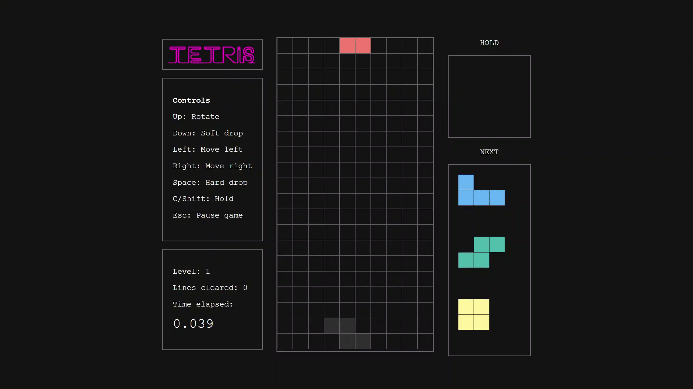

# Tetris in Browser

A classic Tetris game built using HTML, CSS, and vanilla Javascript.

## Features

- **Standard tetrominos**: Includes all 7 pieces (`I`, `J`, `L`, `O`, `S`, `T`, `Z`) with the standard color scheme.
- **Levelling system**: Clear five lines to level up, with the game's speed increasing at each level.
- **Preview pane**: View the next 3 upcoming tetrominos.
- **Ghost piece**: A shadow displaying where the current piece will land.
- **Hold piece**: Temporarily store a piece for later use.
- **Timer**: Shows time elapsed.

## Usage

A running instance is available through this [link](https://eve-1010.github.io/tetris-in-browser/index.html).
 
## Preview

## Controls

This game supports keyboard input only. Use the following keys to control the tetrominos:

|Key|Function|
|---|---|
|Arrow up|Rotate|
|Arrow down|Soft drop|
|Arrow left|Move left|
|Arrow right|Move right|
|Space|Hard drop|
|C or Shift|Hold|
|Esc|Pause game|

## License

This software is licensed under the [MIT License](https://github.com/eve-1010/tetris-in-browser/blob/main/LICENSE) © [Cha](https://github.com/eve-1010)
